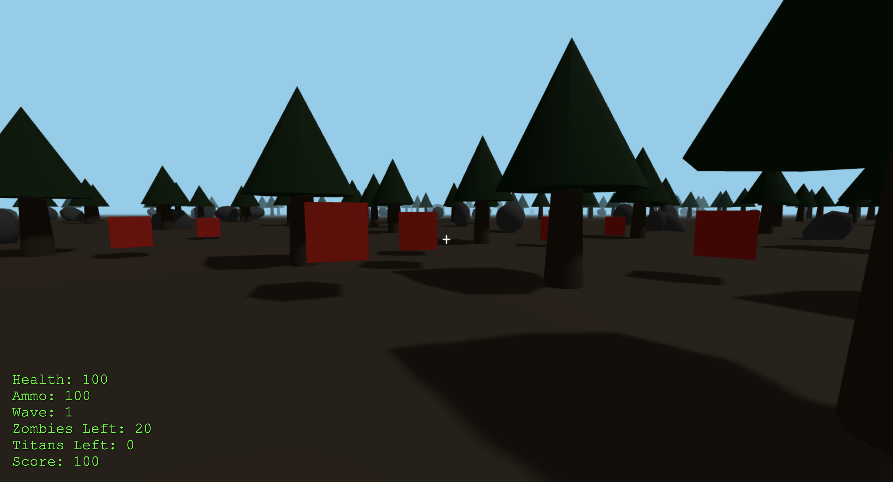

# 1962 FPS Game

A first-person shooter survival game built with Three.js. Fight waves of zombies and titans, compete on the real-time leaderboard, and track your stats across sessions.



## Features

- **Wave-based Survival**: Survive increasingly difficult waves of zombies and titans
- **Real-time Leaderboard**: See how you rank against other active players in real-time
- **Player Statistics**: Track your kills, high scores, best waves, and total playtime
- **Difficulty Levels**: Choose from Easy, Medium, or Hard difficulty
- **Item Pickups**: Collect health and ammo pickups dropped by enemies
- **Score System**: Earn points by killing enemies and surviving waves
- **Pause & Stats**: Pause anytime to view your session and overall statistics

## Tech Stack

### Frontend

- **Three.js** - 3D graphics and rendering
- **Vanilla JavaScript (ES Modules)** - Game logic and client-side functionality
- **Socket.io Client** - Real-time communication with server

### Backend

- **Node.js** - Runtime environment
- **Express** - Web server and API routes
- **Socket.io** - WebSocket server for real-time leaderboard updates
- **MongoDB** - Database for storing player stats and scores
- **Mongoose** - MongoDB object data modeling

## Setup

### Prerequisites

- Node.js (v14 or higher)
- MongoDB (local installation or MongoDB Atlas connection string)
- Laptop/PC

### Installation

1. Clone the repository:

```bash
git clone https://github.com/clarenochieng/1962-FPS.git
cd 1962-FPS
```

2. Install dependencies:

```bash
npm install
```

3. Set up MongoDB:

   - **Option A (Local)**: Ensure MongoDB is running locally on `mongodb://127.0.0.1:27017`
   - **Option B (Remote)**: Create a `.env` file with your MongoDB connection string:
     ```
     MONGODB_URI=mongodb://<your-connection-string>
     PORT=1962
     ```

4. Start the server:

```bash
npm start
```

5. Open your browser and navigate to:

```
http://localhost:1962
```

## Usage

### Starting the Game

1. **Main Menu**: When you first load the game, you'll see the main menu with:

   - Difficulty selector (Easy, Medium, Hard)
   - Active Players leaderboard (updates in real-time)
   - "View Stats" button to see your overall statistics

2. **Select Difficulty**: Click on Easy, Medium, or Hard to choose your difficulty level

3. **Start Playing**: Click anywhere on the screen (outside buttons) to start the game

### Gameplay Controls

- **WASD** or **Arrow Keys** - Move (forward, backward, left, right)
- **Space** - Jump
- **Mouse Click** - Shoot
- **Mouse Movement** - Look around (after clicking to lock pointer)
- **P** - Pause/Resume game

### Game Mechanics

- **Health**: Starts at 100. Take damage from enemies. Collect health pickups to restore health. They appear as green cubes.
- **Ammo**: Limited ammo supply. Collect ammo pickups dropped by enemies. They appear as golden cubes.
- **Waves**: Each wave spawns more enemies. Clear all enemies to advance to the next wave.
- **Scoring**:
  - Zombie kill: 10 points
  - Titan kill: 50 points
  - Wave completion bonus: 100 points

### During Gameplay

- **HUD**: The top-left shows your current health, ammo, wave number, enemies remaining, and score
- **Crosshair**: Center screen crosshair helps you aim
- **Enemies**: Zombies and titans will spawn and attack you. Defeat them to survive
- **Items**: Defeated enemies may drop health or ammo pickups

### Pause Menu

Press **P** during gameplay to pause. The pause menu shows:

- **Session Stats**: Current game's kills, score, wave, and playtime
- **Overall Stats**: Your lifetime statistics across all games
- **Resume**: Press **P** again to resume
- **Quit to Main Menu**: Return to the main menu (your session stats are saved)

### Game Over

When your health reaches 0:

- Your score and stats are automatically saved
- Click "Restart" to start a new game immediately
- Or return to the main menu to view updated stats

### Viewing Statistics

- **From Main Menu**: Click "View Stats" to see your overall player statistics
- **From Pause Menu**: View both session and overall stats while paused
- Stats include: high score, best wave, total kills (zombies/titans), total playtime, games played, deaths

### Leaderboard

- **Main Menu**: Shows all currently active players ranked by score
- **Real-time Updates**: Leaderboard updates automatically as players' scores change
- **Multiple Tabs**: Each browser tab/connection appears as a separate entry
- **Idle State**: Players on the main menu appear with their highest session score

## Project Structure

```
finalproj2/
├── src/
│   ├── server.js          # Express server and Socket.io setup
│   ├── routes/
│   │   └── api.js         # REST API endpoints for scores/stats
│   └── models/
│       ├── PlayerStats.js # Player statistics schema
│       └── Score.js       # Score entry schema
├── public/
│   ├── index.html         # Main HTML file
│   ├── style.css          # Game UI styles
│   └── js/
│       ├── main.js        # Entry point
│       ├── game.js        # Main game logic
│       ├── player.js      # Player controls and mechanics
│       ├── enemy.js       # Enemy AI and wave management
│       ├── world.js       # 3D world generation
│       ├── physics.js     # Collision detection
│       ├── items.js       # Pickup items
│       ├── ui.js          # UI management
│       └── utils.js       # Utility functions and constants
├── package.json           # Dependencies and scripts
├── eslint.config.js      # ESLint configuration
└── README.md             # This file
```

## Scripts

- `npm start` - Start the development server
- `npm run lint` - Run ESLint on all JavaScript files

## Environment Variables

Optional environment variables (defaults provided):

- `PORT` - Server port (default: 1962)
- `MONGODB_URI` - MongoDB connection string (default: mongodb://127.0.0.1:27017/fpsgame)

Create a `.env` file in the project root to set these values.
